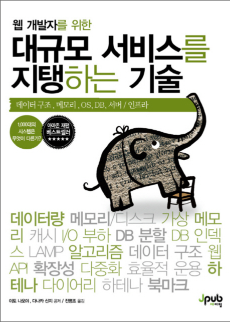

# 대규모 서비스를 지탱하는 기술 책 읽기 스터디
---

---
## 📆 기간
- 일정 : 2022. 02. 26 (토) ~ 2022. 04. 16 (토) - 7주
- 매주 토요일 오전 11시

---
## 🌈 진행 방식
- Google Meet으로 온라인 진행.
- 한 주 동안 목표한 분량을 읽고, Github에 각 스터디원의 디렉토리를 만들어서 공부한 내용 정리하고 스터디 모임 전까지 PR을 올린다.
- 책의 내용뿐만 아니라 개인적으로 공부하면서 찾아봤던 내용들도 함께 정리하면 더욱 좋습니다.
- 정리한 내용을 바탕으로 발표 진행.
- 발표자는 그날 랜덤으로 지정하여 정리한 내용을 스터디원들에게 발표.
- 발표자 선정은 지난 주에 발표를 했더라도 랜덤 선정에 걸리면 예외없이 발표 진행.
- 목표 분량은 약 40p ~ 50p (단원별로 내용이 끊기지 않게 유동적으로 조절)
- 목표 분량은 스터디가 끝나고 정함. 
  - 살짝 살펴보니 중간에 굳이 읽지 않아도 되는 내용들도 있어서 끝나고 다 같이 정하는게 나을 것 같다는 생각입니다.

---
## 진행 진도표
- 1주차
  - 강의 4 ~ 강의 9 (28p ~ 78p) 
- 2주차
- 3주차
- 4주차
- 5주차
- 6주차
- 7주차
